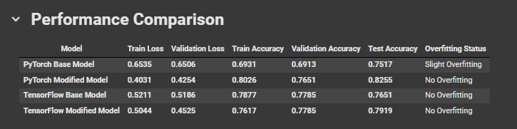

# Neural Network Basics - Model Performance Comparison  

## 📌 Overview  

I wrote this notebook while learning **PyTorch and TensorFlow**. It covers **EDA, data preprocessing, and model performance comparison** to understand **train/test accuracy, overfitting, and improvements** across different neural network architectures.  

## 🚀 Google Colab  

Click the badge below to open this notebook in **Google Colab**:  

  

## 📊 Performance Comparison  

Below is a comparison of different models trained using **PyTorch and TensorFlow**, highlighting key metrics such as **train/test accuracy, validation loss, and overfitting status**.  

  

## 🔍 Steps Performed  

### 1️⃣ EDA & Preprocessing  
- Identified **data distribution, outliers, and correlations**.  
- Applied **MinMaxScaler** and **PowerTransformer** for feature scaling.  
- Addressed class imbalance using **SMOTE**.  

### 2️⃣ Model Development  
- Built **base models** in **PyTorch and TensorFlow**.  
- Enhanced models using **ReLU activation, dropout, and batch normalization** for better generalization.  

### 3️⃣ Training & Evaluation  
- Trained models and evaluated **accuracy/loss**.  
- Compared **PyTorch vs. TensorFlow** models to assess performance improvements.  

---

This notebook provides an insightful **comparison between deep learning frameworks** while reinforcing fundamental concepts of neural networks. 
